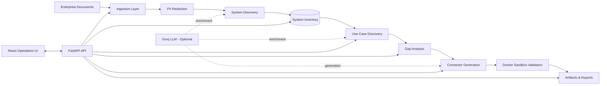
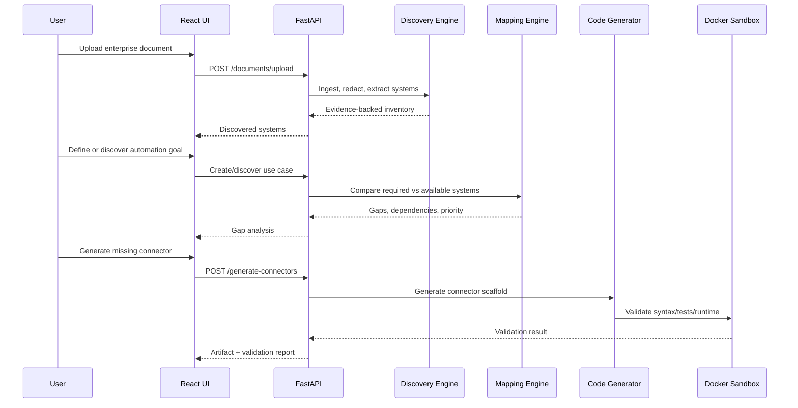
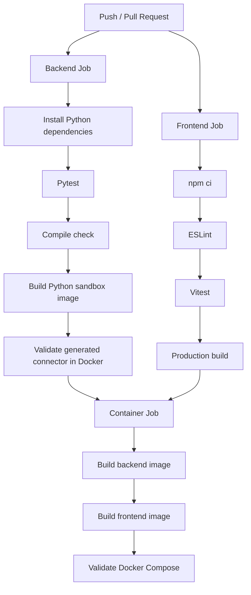

<div align="center">

# Discovery Agent

### Enterprise System Discovery & Integration Intelligence Platform

Turn unstructured enterprise documentation into an **evidence-backed system inventory**, **integration gap analysis**, and **validated connector scaffolds**.

[](https://github.com/mathanvasagam/Discovery_agent/actions/workflows/ci.yml)


</div>

---

## Overview

Discovery Agent is a full-stack system-discovery and integration-planning platform for teams that need to understand an existing application estate before automating business workflows.

Instead of manually reading architecture documents, spreadsheets, PDFs, and operational notes, Discovery Agent ingests those sources, extracts enterprise systems with supporting evidence, builds a normalized inventory, maps automation goals against available capabilities, identifies missing integrations, generates Python or Node.js connector scaffolds, and validates generated artifacts in an isolated execution environment.

The system is intentionally **hybrid**: deterministic extraction and mapping provide predictable fallback behavior, while an optional LLM provider can enrich discovery, mapping, and generation when configured.

> **Current maturity:** production-oriented, test-backed prototype. The core workflow is implemented and containerized; authentication/authorization, database migrations, production observability, and a dedicated remote sandbox service remain recommended before public or multi-user deployment.

---

## Architecture



### Processing flow



---

## Core Capabilities

| Capability | Implementation |
| --- | --- |
| **Multi-format ingestion** | PDF, DOCX, XLSX, CSV, text, Markdown, and image/OCR workflows |
| **Evidence-backed discovery** | Extracted systems retain source-document and page/line metadata where available |
| **Hybrid extraction** | Deterministic enterprise catalog with optional Groq-assisted extraction |
| **Hallucination control** | LLM findings are checked against source evidence before being accepted |
| **System inventory** | Category, auth method, entities, business processes, criticality, confidence, evidence |
| **Use-case discovery** | Manual use cases plus automated discovery from available system context |
| **Gap analysis** | Required/available/missing systems, data flows, dependencies, impact, priority |
| **Connector generation** | Python and Node.js integration scaffolds with tests and supporting files |
| **Secure-by-default validation** | Docker-isolated syntax, static and runtime validation with bounded resources |
| **Operational dashboard** | React + TypeScript interface for inventory, gaps, generation, reports and status |
| **Exports and reports** | Inventory JSON/CSV, gap reports, artifacts and validation history |
| **Deterministic fallback** | Core workflows remain usable when no LLM API key is configured |

---

## Technology Stack

| Layer | Technology |
| --- | --- |
| API | FastAPI |
| Data models / persistence | SQLModel + SQLite |
| Validation / settings | Pydantic Settings |
| Document processing | pdfplumber, openpyxl, Pillow, pytesseract |
| Optional LLM provider | Groq — `llama-3.3-70b-versatile` |
| Frontend | React 19, TypeScript, Vite |
| Styling | Tailwind/PostCSS pipeline |
| Frontend tests | Vitest + Testing Library |
| Backend tests | Pytest |
| Containerization | Docker + Docker Compose |
| Frontend serving | Nginx production image |
| CI | GitHub Actions |

---

## Repository Layout

```text
Discovery_agent/
├── .github/
│   └── workflows/
│       └── ci.yml                 # Backend, frontend and container quality gates
├── backend/
│   ├── core/
│   │   ├── code_gen.py            # Connector + agent-definition generation
│   │   ├── discovery_catalog.py   # Deterministic enterprise-system catalog
│   │   ├── extractor.py           # Evidence-backed system extraction
│   │   ├── ingestor.py            # Multi-format document ingestion
│   │   ├── llm.py                 # Optional LLM provider integration
│   │   ├── mapping_engine.py      # Use-case mapping and gap analysis
│   │   ├── redactor.py            # Sensitive-field redaction
│   │   └── sandbox.py             # Docker/local validation execution
│   ├── sandbox/
│   │   └── python/Dockerfile      # Isolated Python validation image
│   ├── Dockerfile
│   ├── main.py                    # FastAPI routes and orchestration
│   ├── models.py                  # SQLModel persistence models
│   └── settings.py                # Application configuration
├── frontend/
│   ├── src/
│   │   ├── components/
│   │   ├── services/api.ts
│   │   ├── types/api.ts
│   │   ├── App.tsx
│   │   └── App.test.tsx
│   ├── Dockerfile
│   ├── nginx.conf
│   └── package.json
├── docker-compose.yml
├── requirements.txt
└── README.md
```

Runtime uploads, generated connector artifacts, reports, local databases, frontend builds, and local environment files are intentionally excluded from version control.

---

## Quick Start

### Option A — Docker Compose

This is the simplest way to run the application stack.

**Prerequisites**

- Docker Engine / Docker Desktop
- Docker Compose

Build the Python sandbox image used for secure connector validation:

```bash
docker build \
  -t discovery-agent-python-sandbox:3.12 \
  -f backend/sandbox/python/Dockerfile .
```

Start the application:

```bash
docker compose up --build
```

Services:

| Service | URL |
| --- | --- |
| Web application | `http://localhost:8080` |
| FastAPI API | `http://localhost:8000` |
| Health endpoint | `http://localhost:8000/health` |
| OpenAPI docs | `http://localhost:8000/docs` |

Stop the stack:

```bash
docker compose down
```

---

### Option B — Local Development

#### Backend

Python 3.12 is recommended.

```bash
python -m venv .venv
```

Activate the environment:

```bash
# Windows
.venv\Scripts\activate

# Linux / macOS
source .venv/bin/activate
```

Install dependencies and run the API:

```bash
pip install -r requirements.txt
cd backend
python -m uvicorn main:app --reload
```

API: `http://localhost:8000`

#### Frontend

Node.js 22+ is recommended.

```bash
cd frontend
npm ci
npm run dev
```

Development UI: `http://localhost:5173`

---

## Configuration

The backend uses the `DISCOVERY_` environment prefix. A local `backend/.env` file can be used for development, but credentials must never be committed.

### Application configuration

| Variable | Default | Purpose |
| --- | --- | --- |
| `DISCOVERY_DATABASE_URL` | Local SQLite database | SQLModel database connection |
| `DISCOVERY_GROQ_API_KEY` | unset | Enables optional Groq-assisted workflows |
| `DISCOVERY_DEMO_MODE` | `false` | Controls application demo behavior |
| `DISCOVERY_CORS_ORIGINS` | `http://localhost:5173` | Comma-separated allowed browser origins |
| `DISCOVERY_MAX_UPLOAD_BYTES` | `20971520` | Maximum upload size in bytes — 20 MiB by default |

### Sandbox configuration

| Variable | Default | Purpose |
| --- | --- | --- |
| `DISCOVERY_VALIDATION_MODE` | `docker` | `docker` for isolated validation; `local` for trusted development only |
| `DISCOVERY_PYTHON_SANDBOX_IMAGE` | `discovery-agent-python-sandbox:3.12` | Python validation image |
| `DISCOVERY_NODE_SANDBOX_IMAGE` | `node:22-alpine` | Node.js validation image |
| `DISCOVERY_SANDBOX_MEMORY` | `256m` | Container memory limit |
| `DISCOVERY_SANDBOX_CPUS` | `1.0` | Container CPU limit |
| `DISCOVERY_SANDBOX_PIDS` | `128` | Container process limit |

### Optional LLM mode

Without `DISCOVERY_GROQ_API_KEY`, Discovery Agent intentionally falls back to deterministic logic.

```text
LLM configured      -> deterministic foundation + LLM enrichment
LLM not configured  -> deterministic fallback mode
```

This keeps core discovery and mapping behavior available without making the application dependent on an external model provider.

---

## API Surface

The FastAPI service currently exposes the following application routes.

| Method | Route | Purpose |
| --- | --- | --- |
| `GET` | `/health` | Service health |
| `GET` | `/dashboard` | Dashboard summary |
| `POST` | `/documents/upload` | Upload and analyze a document |
| `GET` | `/documents` | List processed documents |
| `GET` | `/inventory` | Query discovered systems |
| `DELETE` | `/inventory` | Clear system inventory |
| `GET` | `/inventory/export/json` | Export inventory as JSON |
| `GET` | `/inventory/export/csv` | Export inventory as CSV |
| `POST` | `/use-cases` | Create an automation use case |
| `GET` | `/use-cases` | List use cases |
| `POST` | `/use-cases/discover` | Auto-discover candidate goals |
| `POST` | `/gap-analysis` | Run integration-gap analysis |
| `GET` | `/gaps/{use_case_id}` | Retrieve a use-case gap report |
| `POST` | `/generate-connectors` | Generate and validate connector scaffolding |
| `GET` | `/artifacts` | List generated artifacts |
| `POST` | `/validate` | Validate a supplied artifact |
| `GET` | `/validations` | List validation history |
| `GET` | `/reports` | Retrieve consolidated report data |
| `GET` | `/reports/gaps/{use_case_id}.json` | Export a gap report |
| `GET` | `/demo/workflow` | Demo workflow data |

Interactive API documentation is automatically available at `/docs` while the FastAPI service is running.

---

## Security Model

Generated-code execution is one of the highest-risk parts of an integration-generation system. Discovery Agent therefore defaults to **containerized validation**, not host execution.

### Docker sandbox controls

Generated code is executed with:

- no container network access (`--network none`)
- configurable memory limit — default `256m`
- configurable CPU limit — default `1.0`
- configurable PID limit — default `128`
- read-only container root filesystem
- all Linux capabilities dropped
- `no-new-privileges`
- bounded temporary filesystem
- bounded command execution time
- temporary workspace lifecycle
- normalized generated artifact filenames

If Docker is unavailable while `DISCOVERY_VALIDATION_MODE=docker`, validation **fails closed** rather than silently executing generated code on the host.

### Upload controls

The upload path includes:

- normalized filenames
- extension allow-listing
- bounded upload size
- unique destination naming
- partial-file cleanup on failed uploads

### Current security boundary

Authentication and authorization are **not yet implemented**. The current deployment should therefore be treated as a trusted/local or controlled-environment application until identity, access control, rate limiting, and production ingress controls are added.

> `DISCOVERY_VALIDATION_MODE=local` executes generated code on the host and is intended only for trusted local development.

---

## Testing & Quality Gates

The current audited project state passes the following checks:

| Quality gate | Verified result |
| --- | --- |
| Backend Pytest suite | **14 / 14 passed** |
| Backend compile check | **Passed** |
| Frontend ESLint | **0 errors, 0 warnings** |
| Frontend Vitest suite | **4 / 4 passed** |
| TypeScript / Vite production build | **Passed** |
| Real `POST /use-cases` smoke test | **Passed — HTTP 201** |
| Generated Python connector validation | **Passed in explicit trusted-local mode** |
| Docker-unavailable secure failure path | **Passed** |
| Docker Compose configuration | **Validated** |
| GitHub Actions YAML | **Validated** |

### Run backend checks

```bash
cd backend
python -m pytest core -q
python -m compileall -q .
```

### Run frontend checks

```bash
cd frontend
npm run lint
npm test
npm run build
```

---

## Continuous Integration

Every push and pull request executes GitHub Actions quality gates.



CI configuration: `.github/workflows/ci.yml`

---

## How Discovery Decisions Are Made

### Explicit systems

Known systems such as Salesforce, NetSuite, Jira, Stripe, Workday, Slack, and PostgreSQL can be identified through deterministic catalog matching and supporting text evidence.

### Inferred systems

Generic or inferred system findings receive lower confidence and can be marked for human review.

### LLM findings

When the optional model provider is enabled, returned system names are validated against the source chunk before being accepted. This provides a practical hallucination-reduction layer rather than blindly persisting model output.

> Confidence values are implementation heuristics. They should be interpreted as extraction confidence indicators, not statistically calibrated probabilities.

---

## Connector Generation

Discovery Agent can produce Python and Node.js connector packages containing generated implementation code, tests, dependency metadata, configuration files where applicable, a README, and an associated agent definition.

The deterministic fallback generator intentionally produces **connector scaffolding** rather than pretending to know every vendor's production API contract.

For production integrations, generated artifacts should still undergo:

1. vendor API contract verification
2. authentication review
3. secrets-management integration
4. integration and acceptance testing
5. security review
6. operational monitoring design

---

## Deployment Notes

The repository contains production-oriented container definitions:

- backend: Python 3.12 API container running as a non-root user
- frontend: multi-stage Node 22 build served by Nginx
- Compose: backend/frontend orchestration and persistent backend data mount
- sandbox: dedicated Python validation image

For an internet-facing deployment, add at minimum:

- authentication and role-based authorization
- TLS termination / trusted reverse proxy
- secret manager integration
- managed production database
- database migrations
- rate limiting and request quotas
- structured logs and distributed tracing
- metrics, alerting and health monitoring
- object storage or managed document storage
- dedicated sandbox worker/service isolated from the API host

---

## Current Limitations

- No authentication or authorization layer yet.
- SQLite is appropriate for the current scope but should be replaced with a managed database for multi-instance production deployment.
- Schema migrations are not yet managed through Alembic or an equivalent migration framework.
- Generated fallback connectors are generic scaffolds, not guaranteed vendor-certified implementations.
- Confidence scores are heuristic rather than calibrated against a labelled benchmark dataset.
- Raw uploaded documents are stored locally; highly sensitive deployments should use encrypted managed storage and explicit retention policies.
- Full Docker sandbox execution requires a running Docker engine and the configured sandbox image.

---

## Roadmap

- [ ] Authentication and role-based access control
- [ ] Alembic database migrations
- [ ] PostgreSQL production persistence option
- [ ] Structured JSON logging and request correlation IDs
- [ ] Metrics / tracing / operational dashboards
- [ ] Rate limiting and upload quotas
- [ ] Dedicated sandbox worker service
- [ ] Provider-neutral LLM abstraction
- [ ] Calibrated extraction evaluation dataset
- [ ] Vendor-specific connector adapters and contract tests
- [ ] End-to-end browser/API integration tests

---

## Development Workflow

Recommended workflow for changes:

```bash
# 1. Create a branch
git checkout -b feature/<name>

# 2. Run backend checks
cd backend
python -m pytest core -q
python -m compileall -q .

# 3. Run frontend checks
cd ../frontend
npm run lint
npm test
npm run build

# 4. Validate containers from the repository root
cd ..
docker compose config
```

Pull requests should keep application behavior, tests, documentation, and deployment configuration consistent.

---

## Project Status

**Production-oriented prototype / strong engineering portfolio project.**

Discovery Agent currently demonstrates a complete enterprise automation-discovery workflow across document processing, hybrid AI/deterministic reasoning, system inventory management, integration-gap analysis, code generation, secure validation, full-stack application development, containerization, and continuous integration.

The project deliberately documents its current production boundaries instead of presenting prototype behavior as guaranteed enterprise readiness.

---

<div align="center">

Built as an engineering-focused system for **enterprise discovery, integration planning, and safe connector generation**.

</div>
