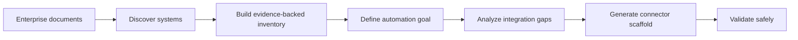
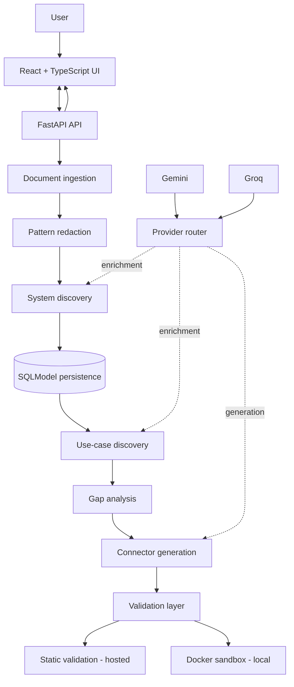
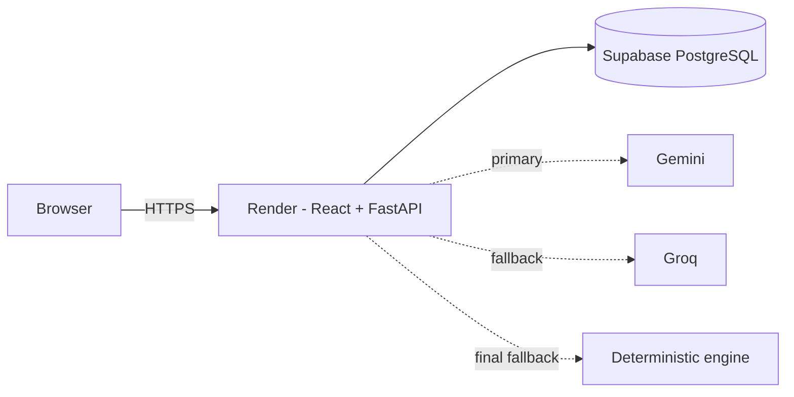

<div align="center">

# Discovery Agent

### Enterprise System Discovery & Integration Intelligence

Turn unstructured enterprise documentation into an **evidence-backed system inventory**, identify **integration gaps**, and generate **validated connector scaffolds**.


</div>


## What Discovery Agent Does

Enterprise automation often starts with a basic problem: **nobody has a reliable, structured view of the systems already in use, the evidence behind them, or the integrations still missing**.

Discovery Agent turns documents such as architecture notes, operational PDFs, spreadsheets, and system documentation into an integration-planning workflow:



The application combines deterministic extraction and mapping with optional LLM enrichment. If external AI providers are unavailable, the core workflow continues through deterministic fallback logic.

---

## 30-Second Example

A team wants to automate invoicing after a sales opportunity is approved.

| Step | Discovery Agent result |
| --- | --- |
| Upload documentation | Extracts systems and supporting evidence |
| Build inventory | Finds systems such as Salesforce and NetSuite |
| Define goal | `Invoice Automation` |
| Gap analysis | Salesforce — available; NetSuite — available; Stripe — missing |
| Generate | Creates a Stripe connector scaffold with tests and metadata |
| Validate | Uses static validation in the hosted demo or Docker-isolated validation locally |

The result is not just a generated answer. Each discovered system can retain source context, confidence information, and human-review signals.

---

## Core Capabilities

| Capability | What it provides |
| --- | --- |
| **Multi-format ingestion** | PDF, DOCX, XLSX, CSV, Markdown, text, and image/OCR workflows |
| **Evidence-backed discovery** | Systems are linked to source evidence and page/line metadata where available |
| **Hybrid reasoning** | Deterministic catalog and mapping logic with Gemini/Groq enrichment |
| **Hallucination control** | LLM findings are checked against source evidence before persistence |
| **System inventory** | Category, auth method, entities, processes, criticality, evidence, and confidence |
| **Use-case discovery** | Manual or automatically suggested automation goals |
| **Gap analysis** | Required, available, and missing systems with dependencies and priority |
| **Connector generation** | Python and Node.js scaffolds, tests, dependencies, README, and agent metadata |
| **Safe validation** | Static-only validation in the public demo; constrained Docker validation locally |
| **Reports & exports** | Inventory exports, gap reports, artifacts, and validation history |

---

## Architecture



### Hosted demo



The public demo runs as a **single same-origin service**: FastAPI serves both the API and the built React application. Persistent application state is stored in Supabase PostgreSQL rather than the host filesystem.

---

## Trust & Security Design

Discovery Agent treats uploaded documents, generated code, and multi-user demo access as separate security boundaries.

The hosted demo includes:

- signed anonymous workspace isolation
- per-workspace database filtering
- rate limits on expensive or mutating endpoints
- trusted-host validation
- restrictive production HTTP security headers
- bounded upload size and extension allow-listing
- normalized upload and artifact paths
- non-retained original uploads in public-demo mode
- redacted extracted text for subsequent discovery workflows
- static-only hosted validation so generated code is **not executed** on the public server
- secret configuration through deployment environment variables, not source control

For trusted local development, generated connectors can instead be validated in a constrained Docker sandbox with no network access, dropped capabilities, a read-only root filesystem, process/memory/CPU limits, and bounded execution time.

> The public demo uses anonymous workspace isolation, not authenticated enterprise tenancy. A production SaaS deployment should add identity, organization-level authorization/RBAC, managed migrations, distributed rate limiting, centralized audit logging, and dedicated sandbox infrastructure.

---

## Technology Stack

| Layer | Technology |
| --- | --- |
| Frontend | React 19, TypeScript, Vite |
| API | FastAPI |
| Data models | SQLModel / SQLAlchemy |
| Local persistence | SQLite |
| Hosted persistence | PostgreSQL via Supabase |
| Document processing | pdfplumber, openpyxl, Pillow, pytesseract |
| AI providers | Gemini + Groq with configurable failover |
| Validation | Static hosted validation + Docker sandbox for local development |
| Testing | Pytest, Vitest, Testing Library, ESLint, TypeScript |
| Deployment | Docker, Render Blueprint, Supabase |
| CI | GitHub Actions |

---

## Provider Strategy

Discovery Agent does not depend on a single LLM provider.

```text
Gemini
  ↓ unavailable / quota / request failure
Groq
  ↓ unavailable / quota / request failure
Deterministic fallback
```

The deterministic foundation remains available even with no LLM credentials configured. This is deliberate: provider failure should degrade enrichment, not disable the entire workflow.

---

## Quick Start

### Prerequisites

- Python 3.12 recommended
- Node.js 22+
- npm
- Docker Desktop / Docker Engine for local sandbox validation

### Install

```bash
git clone https://github.com/mathanvasagam/Discovery_agent.git
cd Discovery_agent

python -m venv .venv
```

Activate the environment:

```bash
# Windows
.venv\Scripts\activate

# Linux / macOS
source .venv/bin/activate
```

Install dependencies:

```bash
python -m pip install -r requirements.txt
cd frontend
npm ci
cd ..
```

### Run locally

```bash
python scripts/dev.py --check
python scripts/dev.py
```

| Service | Address |
| --- | --- |
| Web UI | `http://127.0.0.1:5173` |
| API | `http://127.0.0.1:8000` |
| Health | `http://127.0.0.1:8000/health` |
| OpenAPI | `http://127.0.0.1:8000/docs` |

For secure local Python connector validation, build the sandbox image once:

```bash
docker build -t discovery-agent-python-sandbox:3.12 -f backend/sandbox/python/Dockerfile .
```

---

## Configuration

Local configuration is loaded from a project-root `.env` file. Secrets must never be committed.

Common variables:

```dotenv
DISCOVERY_DATABASE_URL=sqlite:///...
DISCOVERY_VALIDATION_MODE=docker
DISCOVERY_LLM_PROVIDER_ORDER=gemini,groq
DISCOVERY_GROQ_API_KEY=...
GEMINI_API_KEY=...
```

Hosted demo settings additionally enable PostgreSQL persistence, workspace isolation, rate limits, non-retained original uploads, and static validation.

See **[docs/DEPLOYMENT.md](docs/DEPLOYMENT.md)** for the complete Render + Supabase configuration.

---

## API at a Glance

| Area | Endpoints |
| --- | --- |
| Health | `GET /healthz` (liveness), `GET /health` (runtime state), `GET /ready` (database readiness) |
| Documents | `POST /documents/upload`, `GET /documents` |
| Inventory | `GET /inventory`, exports, clear inventory |
| Use cases | create, list, auto-discover |
| Gap analysis | run analysis, retrieve/export reports |
| Generation | generate connectors and agent definitions |
| Validation | validate artifacts and inspect history |
| Reports | consolidated workspace reporting |

FastAPI exposes interactive OpenAPI documentation at `/docs` in development mode.

---

## Quality Gates

The repository has a single verification command:

```bash
python scripts/verify.py
```

Current verified local state:

| Check | Result |
| --- | --- |
| Backend Pytest | **18 / 18 passed** |
| Backend compile check | **Passed** |
| Frontend ESLint | **Passed** |
| Frontend Vitest | **5 / 5 passed** |
| TypeScript build | **Passed** |
| Vite production build | **Passed** |

GitHub Actions runs backend, frontend, and container-oriented checks on pushes and pull requests. The Render Blueprint is configured to deploy after repository checks pass.

---

## Repository Structure

```text
Discovery_agent/
├── backend/
│   ├── core/
│   │   ├── discovery_catalog.py
│   │   ├── extractor.py
│   │   ├── ingestor.py
│   │   ├── mapping_engine.py
│   │   ├── provider_router.py
│   │   ├── code_generation_provider.py
│   │   ├── redactor.py
│   │   ├── security.py
│   │   └── sandbox.py
│   ├── main.py
│   ├── models.py
│   └── settings.py
├── frontend/
│   └── src/
│       ├── app/
│       ├── components/
│       ├── pages/
│       └── services/
├── docs/
│   ├── TECHNICAL_GUIDE.md
│   └── DEPLOYMENT.md
├── scripts/
│   ├── dev.py
│   └── verify.py
├── render.yaml
├── docker-compose.yml
└── README.md
```

---

## Documentation

| Document | Purpose |
| --- | --- |
| [Technical Guide](docs/TECHNICAL_GUIDE.md) | Architecture, module-by-module behavior, terminology, security, troubleshooting, and interview-review material |
| [Deployment Guide](docs/DEPLOYMENT.md) | Render + Supabase deployment, secret configuration, production profile, and post-deployment checks |

The README is intentionally kept focused on **what the product does and how to run it**. Deep implementation detail lives in the documentation above.

---

## Current Boundaries

Discovery Agent is a **production-oriented engineering prototype and public portfolio demo**, not a vendor-certified integration platform.

Current limitations include:

- anonymous workspace isolation rather than authenticated users/organizations
- heuristic confidence scores rather than calibrated probabilities
- generated connectors are scaffolds and require vendor-contract review before production use
- no managed migration layer such as Alembic yet
- no dedicated remote runtime sandbox service
- local OCR quality depends on the source document and OCR environment

These boundaries are documented intentionally rather than hidden behind a “production-ready” label.

---

## Live Demo

**https://discovery-agent-demo.onrender.com/**

The application is hosted on Render's free service tier, so the first request after an idle period can take longer while the service wakes up.

---

<div align="center">

Built as an engineering-focused platform for **enterprise discovery, integration planning, and safer connector generation**.

[Live Demo](https://discovery-agent-demo.onrender.com/) · [Technical Guide](docs/TECHNICAL_GUIDE.md) · [Deployment Guide](docs/DEPLOYMENT.md)

</div>
