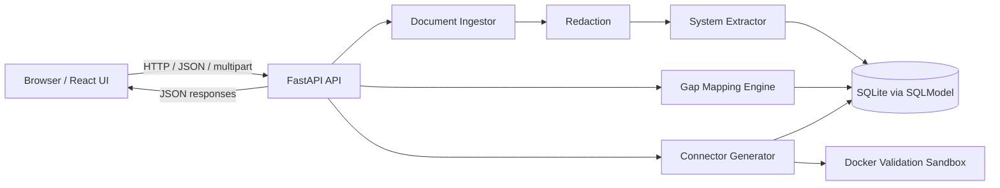
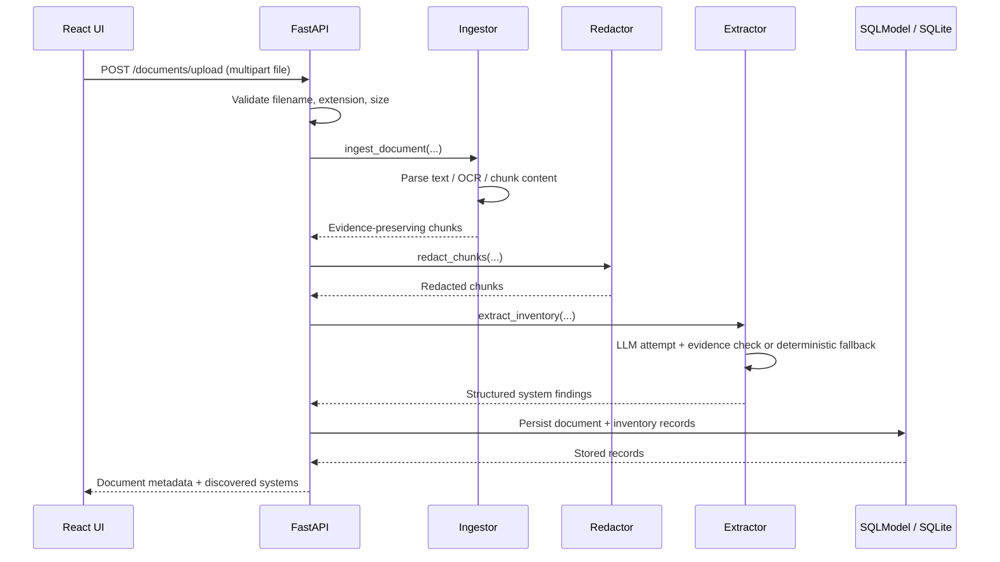
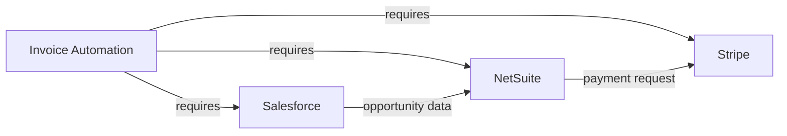
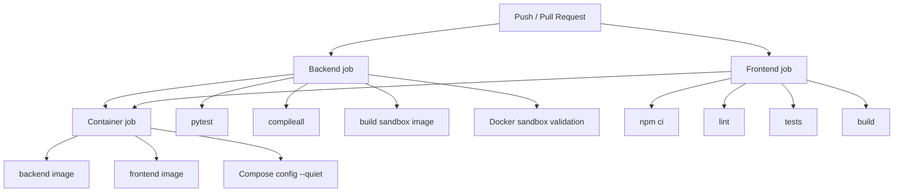

# Discovery Agent — Technical Guide

This document explains how Discovery Agent works from first principles. It is intended for developers, reviewers, interview preparation, and anyone who needs to understand the project beyond the UI.

The goal is not to memorize file names. The goal is to understand the engineering ideas behind the system, why each idea exists, and where it appears in this repository.

---

## 1. What problem does Discovery Agent solve?

Large organizations often have many software systems: CRM platforms, ERP platforms, payment systems, ticketing tools, HR systems, databases, internal applications, and legacy systems. Before automating a business process, an engineer needs to answer questions such as:

- Which systems are actually present?
- What evidence proves that a system is used?
- Which systems are required for a proposed automation?
- Which required systems are missing from the current inventory?
- What data should flow from one system to another?
- Which integration should be built first?
- Can an initial connector scaffold be generated and validated safely?

Discovery Agent turns operational documents into an evidence-backed system inventory, maps business goals against that inventory, identifies integration gaps, generates connector scaffolds, and validates generated code.

The project is best described as a **production-oriented enterprise integration discovery prototype**. It has real engineering controls and automated tests, but it does not yet include all controls required for an internet-facing multi-user production service.

---

## 2. High-level architecture



### Core idea

The frontend does not perform enterprise discovery itself. It is an operator interface. The backend owns ingestion, extraction, mapping, persistence, generation, and validation.

That separation matters because browser code is easy for a user to inspect and manipulate. Business rules, database writes, secrets, and generated-code execution belong on the server side.

---

## 3. End-to-end request lifecycle

Consider a user uploading a PDF.



A key design principle is that **evidence metadata travels through the pipeline**. The system tries to preserve page numbers, line numbers, source file references, and the sentence that justified a discovery.

---

# Part I — Web and API fundamentals

## 4. What is a client and what is a server?

A **client** requests work. A **server** receives requests and returns responses.

In this project:

- React running in the browser is the client.
- FastAPI running on port `8000` is the server.

The browser normally runs at:

```text
http://localhost:5173
```

The backend normally runs at:

```text
http://localhost:8000
```

The frontend API wrapper is:

```text
frontend/src/services/api.ts
```

The backend HTTP routes are primarily defined in:

```text
backend/main.py
```

---

## 5. What is HTTP?

**HTTP — Hypertext Transfer Protocol** — is the protocol browsers and web servers use to communicate.

An HTTP request contains information such as:

- method (`GET`, `POST`, `DELETE`, ...)
- URL/path
- headers
- optional request body

A response contains:

- status code (`200`, `201`, `400`, `404`, `500`, ...)
- headers
- response body

Examples from Discovery Agent:

| Method | Endpoint | Purpose |
|---|---|---|
| `GET` | `/health` | Read backend/provider status |
| `POST` | `/documents/upload` | Upload and process a document |
| `GET` | `/inventory` | Query discovered systems |
| `DELETE` | `/inventory` | Clear the inventory |
| `POST` | `/use-cases` | Create an automation goal |
| `GET` | `/gaps/{use_case_id}` | Read an integration gap report |
| `POST` | `/generate-connectors` | Generate and validate a connector |
| `POST` | `/validate` | Validate an artifact |
| `GET` | `/reports` | Read consolidated workspace output |

---

## 6. What is REST?

**REST** is a common style for designing HTTP APIs around resources and standard HTTP methods.

Discovery Agent is REST-like:

- documents are resources;
- inventory systems are resources;
- use cases are resources;
- generated artifacts are resources;
- validations are resources.

For example:

```text
GET /inventory
```

means “read inventory resources,” while:

```text
DELETE /inventory
```

means “delete inventory resources.”

---

## 7. What is an endpoint?

An **endpoint** is one address + HTTP method exposed by the API.

These are different endpoints even though the path is the same:

```text
GET    /inventory
DELETE /inventory
```

FastAPI maps Python functions to endpoints using decorators in `backend/main.py`.

Conceptually:

```python
@app.get("/inventory")
async def list_inventory(...):
    ...
```

means: when the server receives `GET /inventory`, FastAPI calls `list_inventory`.

---

## 8. What is JSON?

**JSON — JavaScript Object Notation** — is a text format for structured data.

Example:

```json
{
  "name": "Salesforce",
  "category": "CRM",
  "confidence_score": 0.98
}
```

The frontend and backend exchange most application data as JSON.

TypeScript interfaces in:

```text
frontend/src/types/api.ts
```

document the expected response shapes on the frontend.

SQLModel/Pydantic request models in:

```text
backend/models.py
```

document many expected request shapes on the backend.

---

## 9. What is multipart/form-data?

JSON is not ideal for uploading binary files such as PDFs. File uploads commonly use **multipart/form-data**.

The frontend creates a `FormData` object in:

```text
frontend/src/services/api.ts
```

and sends it to:

```text
POST /documents/upload
```

FastAPI receives the uploaded file as an upload object.

The backend then validates the filename, extension, and maximum allowed size before accepting it.

---

## 10. What is CORS?

**CORS — Cross-Origin Resource Sharing** — is a browser security mechanism.

The browser considers these different origins:

```text
http://localhost:5173
http://localhost:8000
```

because their ports are different.

The backend therefore has CORS middleware that defines which frontend origins may call the API.

The relevant environment variable is:

```text
DISCOVERY_CORS_ORIGINS
```

Why not simply allow `*`?

Because a production API should not automatically trust every website on the internet to issue browser requests to it.

---

# Part II — Backend architecture

## 11. What is FastAPI?

**FastAPI** is the Python web framework used by the backend.

It provides:

- HTTP routing;
- request parsing;
- response serialization;
- validation integration;
- asynchronous route support;
- automatic OpenAPI documentation.

Main application file:

```text
backend/main.py
```

Important functions include:

- `health`
- `dashboard`
- `upload_document`
- `list_inventory`
- `create_use_case`
- `discover_goals`
- `gap_report`
- `generate_connectors`
- `validate`
- `reports`

---

## 12. What does `async def` mean?

Many FastAPI endpoints use:

```python
async def
```

An asynchronous function can yield control while waiting for I/O instead of blocking the entire event loop.

Typical I/O includes:

- reading network responses;
- receiving uploaded files;
- waiting for external providers.

Not every Python function needs to be asynchronous. CPU-only helpers and many local parsing functions remain normal `def` functions.

---

## 13. What is Pydantic?

**Pydantic** validates structured Python data against declared types.

For example, `ConnectorGenerationRequest` in:

```text
backend/models.py
```

defines fields such as:

- `system_name`
- `category`
- `auth_method`
- `use_case_title`
- `language`

FastAPI can use these models to reject malformed request bodies before business logic runs.

---

## 14. What is SQLModel?

**SQLModel** combines ideas from Pydantic and SQLAlchemy.

It allows classes to represent database tables while still using Python type annotations.

Examples in `backend/models.py`:

- `DocumentRecord`
- `InventorySystem`
- `UseCase`
- `GapReportRecord`
- `GeneratedArtifact`
- `ValidationRun`

---

## 15. What is an ORM?

**ORM — Object Relational Mapper** — maps programming-language objects to relational database rows.

Without an ORM, you might write SQL manually:

```sql
INSERT INTO inventory_system (...) VALUES (...);
```

With an ORM, the application creates an `InventorySystem` object and asks the database session to persist it.

ORMs reduce repetitive SQL, but engineers still need to understand database concepts such as primary keys, foreign keys, indexes, transactions, and migrations.

---

## 16. What is SQLite?

**SQLite** is a relational database stored in a local file.

Discovery Agent uses SQLite by default, with a database URL pointing to a file under `backend/`.

Advantages for this project:

- zero external database server required;
- simple local demonstrations;
- reproducible development.

Limitations for a larger production deployment:

- limited concurrent-write behavior compared with server databases;
- local-file persistence does not naturally scale across many application replicas;
- schema migrations still need formal management.

A production evolution could use PostgreSQL while preserving most SQLModel concepts.

---

## 17. What is persistence?

**Persistence** means data survives after one request finishes.

If inventory existed only in a Python variable, restarting the server would erase it.

The database persists:

- uploaded-document metadata;
- discovered system inventory;
- use cases;
- gap reports;
- generated artifact metadata;
- validation results.

Generated code files themselves are also written beneath the generated-data directory.

---

## 18. What are primary and foreign keys?

A **primary key** uniquely identifies a row.

Example:

```text
InventorySystem.id
```

A **foreign key** links one table to another.

Example:

```text
GapReportRecord.use_case_id
```

references a use case.

This lets the application answer: “Which gap report belongs to which automation goal?”

---

# Part III — Document ingestion

## 19. What is ingestion?

**Ingestion** is the process of accepting external data and converting it into an internal representation that later stages can process.

Main implementation:

```text
backend/core/ingestor.py
```

Entry point:

```text
ingest_document(...)
```

---

## 20. Supported document formats

The ingestor contains specialized readers for:

- plain text;
- Markdown;
- CSV;
- PDF;
- DOCX;
- XLSX;
- images.

Important functions:

| Function | Role |
|---|---|
| `_read_text_file` | Read line-based text |
| `_read_pdf_file` | Extract PDF page text |
| `_read_docx_file` | Read Word XML inside a DOCX ZIP container |
| `_read_excel_file` | Read spreadsheet cells with `openpyxl` |
| `_read_csv_file` | Read CSV rows |
| `_read_image_file` | OCR an image |
| `_load_blocks` | Select the correct reader |
| `ingest_document` | Produce normalized chunks |

---

## 21. What is OCR?

**OCR — Optical Character Recognition** — converts text visible in an image into machine-readable characters.

Discovery Agent uses:

```text
pytesseract
```

For PDFs, the project first tries normal text extraction with:

```text
pdfplumber
```

If a page has no extractable text, it attempts an OCR fallback by rendering the page to an image and running Tesseract.

This is useful for scanned PDFs.

OCR is not perfect. Recognition quality depends on resolution, scan quality, language, layout, and fonts.

---

## 22. What is chunking?

LLM/extraction systems often process a large document in smaller units called **chunks**.

Discovery Agent uses sliding chunks with defaults approximately equivalent to:

```text
chunk size    = 1000 characters
chunk overlap = 200 characters
```

Why overlap?

Imagine an important sentence begins near the end of one chunk and finishes in the next. Overlap reduces the chance of losing the relationship between those words.

The helper is:

```text
_sliding_chunks
```

in `backend/core/ingestor.py`.

---

## 23. What is metadata?

**Metadata** is data describing other data.

Each chunk can carry metadata such as:

- source document path;
- content type;
- chunk index;
- page number;
- line number;
- sheet name.

This is critical because extraction without traceability is difficult to review.

---

# Part IV — Redaction and evidence

## 24. What is redaction?

**Redaction** removes or replaces sensitive content before downstream processing.

Implementation:

```text
backend/core/redactor.py
```

The active `redact_text` path currently replaces:

- email addresses with `[EMAIL]`;
- phone numbers with `[PHONE]`;
- IPv4-style addresses with `[IP_ADDRESS]`.

### Important limitation

A person-name regular expression and a guarded-name helper exist in the file, but the active `redact_text` function does **not** currently apply person-name redaction.

Therefore the correct claim is:

> Discovery Agent performs limited pattern-based redaction for email, phone, and IP data.

It should not be described as a comprehensive PII anonymization system.

---

## 25. What is evidence-backed discovery?

A discovery result should answer not just:

> “Salesforce exists.”

but also:

> “Why do you believe Salesforce exists?”

An `InventorySystem` stores fields including:

- `evidence`;
- `all_evidence`;
- `source_reference`;
- `all_sources`;
- `page_number`;
- `line_number`.

The extractor tries to select the sentence containing the system mention.

This makes findings easier to audit and review.

---

# Part V — Deterministic extraction and LLM assistance

## 26. What does deterministic mean?

A **deterministic** method follows explicit programmed rules.

Given the same input and rules, it should produce the same result.

Discovery Agent contains a known enterprise-system catalog in:

```text
backend/core/discovery_catalog.py
```

The deterministic extractor checks document text against aliases from that catalog.

Example conceptually:

```text
"Salesforce CRM" -> Salesforce profile
"Jira"           -> Jira profile
```

It also includes generic patterns such as:

- `mainframe`
- `database`
- `erp system`
- `crm tool`
- `legacy app`

Generic matches receive lower confidence and require human review.

---

## 27. What is an LLM?

**LLM — Large Language Model** — is a model trained to generate and interpret natural-language/token sequences.

Discovery Agent can optionally call Groq-hosted model inference through:

```text
backend/core/llm.py
```

Provider configuration is optional.

If no Groq client is configured, `call_llm` returns `None` and the application continues using deterministic fallback behavior.

This is important operationally: the core discovery workflow is not completely dependent on an external model provider.

---

## 28. What is Groq in this project?

Groq is the configured model API provider.

Important environment values include:

```text
DISCOVERY_GROQ_API_KEY
DISCOVERY_GROQ_MODEL
DISCOVERY_LLM_TIMEOUT_SECONDS
```

The default model configured in settings is currently:

```text
openai/gpt-oss-120b
```

The key is read server-side. The backend status API must never return the secret itself.

---

## 29. What is fallback mode?

A **fallback** is an alternate execution path used when the preferred path is unavailable or invalid.

Discovery Agent uses this pattern heavily.

### Extraction

1. Attempt provider-assisted extraction.
2. Validate that proposed system names are supported by source text.
3. If the provider is unavailable or extraction fails, run deterministic extraction.

### Connector generation

1. Attempt LLM-generated artifact.
2. Validate it.
3. If validation fails, return deterministic Python/Node scaffold templates.

Fallback design improves resilience and demo reproducibility.

---

## 30. What is hallucination checking?

An LLM may generate a plausible system name that was never present in the source. This is commonly called **hallucination**.

In `backend/core/extractor.py`, model-produced system names are checked against the original chunk text.

If no meaningful evidence for the system name is found, the proposed result is rejected.

This is a useful guard, but it is not a mathematical proof that every accepted result is correct.

---

## 31. What does confidence mean here?

Discovery Agent exposes a `confidence_score`.

Important: this is a **heuristic score**, not a calibrated statistical probability.

Examples in the deterministic extractor:

- known explicit profile match: approximately `0.98`;
- generic inferred system pattern: approximately `0.60`.

Provider output can also supply confidence values, with normalization rules.

Do **not** interpret `0.98` as scientifically proving “98% probability that this system exists.”

The UI therefore labels it as **heuristic confidence**.

---

# Part VI — Use cases, gaps, and dependency modeling

## 32. What is a use case?

A use case describes an automation goal.

A `UseCase` can contain:

- title;
- description;
- business goal;
- target systems;
- data flows;
- frequency;
- criticality.

Example:

```text
Goal: Automatically create invoices from Salesforce opportunities.
Systems: Salesforce, NetSuite, Stripe
Frequency: Daily
Criticality: High
```

---

## 33. What is gap analysis?

**Gap analysis** compares what a use case requires with what the discovered inventory contains.

Implementation:

```text
backend/core/mapping_engine.py
```

Entry point:

```text
map_use_case_to_inventory(...)
```

The result contains concepts such as:

- required systems;
- available systems;
- missing systems;
- integration gaps;
- data flows;
- dependencies;
- business impact;
- priority score;
- strategic recommendation.

---

## 34. What is a data flow?

A **data flow** describes movement of an entity from a source system to a destination system.

Example:

```text
Salesforce -> NetSuite
Entity: Invoice
Trigger: Opportunity Closed
```

Discovery Agent can flag a flow as blocked when either source or destination is absent from the discovered inventory.

---

## 35. What is a dependency graph?

A **graph** consists of nodes and edges.

In this project:

- a use case can be a node;
- a system can be a node;
- “requires” can be an edge;
- data movement can be an edge.

Example:



Graphs are useful because enterprise dependencies are rarely simple lists.

---

## 36. What is prioritization?

The deterministic mapper combines frequency and criticality weights.

A missing system receives additional importance because it blocks automation.

The result is a heuristic priority score and label such as:

- Low;
- Medium;
- High;
- Critical.

Like discovery confidence, this is a rule-based decision aid, not a universal enterprise prioritization formula.

---

# Part VII — Connector generation

## 37. What is a connector?

A **connector** is code that communicates with another system through an interface, usually an API.

A connector commonly handles:

- authentication;
- HTTP requests;
- CRUD operations;
- pagination;
- rate limiting;
- retries;
- error handling;
- logging.

Discovery Agent generates connector **scaffolds** for Python and Node.js.

Main implementation:

```text
backend/core/code_gen.py
```

---

## 38. What does scaffold mean?

A **scaffold** is a structured starting point, not a guaranteed vendor-ready integration.

The generated deterministic connector assumes generic API conventions such as paths resembling:

```text
/api/{entity}
```

A real Salesforce, SAP, NetSuite, Workday, or Stripe production integration may require vendor-specific:

- endpoints;
- OAuth flows;
- schemas;
- pagination behavior;
- webhooks;
- SDKs;
- retry semantics;
- rate limits.

Therefore generated output must be reviewed and adapted before real deployment.

---

## 39. What is CRUD?

**CRUD** means:

- Create;
- Read;
- Update;
- Delete.

Generated connectors expose generic methods such as:

- `create_record`
- `get_record`
- `update_record`
- `delete_record`
- `list_records`

---

## 40. What is authentication?

**Authentication** proves identity to another system.

The connector generator receives an `auth_method` description. Deterministic scaffolds currently use a generic token/Bearer-header approach.

Real enterprise connectors may need OAuth2 authorization-code flows, client credentials, signed requests, certificates, token refresh, API keys, or vendor SDK authentication.

---

## 41. What is rate limiting?

External APIs often limit how many requests a client may send.

A **rate limiter** intentionally spaces requests to avoid exceeding that provider limit.

The generated scaffolds include basic rate-limiting behavior and special handling for HTTP `429 Too Many Requests`.

---

## 42. What is retry logic?

Networks fail temporarily. A retry policy can repeat a failed operation.

The generated scaffolds include bounded retries rather than retrying forever.

Production retry design should also consider:

- idempotency;
- exponential backoff;
- jitter;
- which errors are retryable;
- maximum elapsed time.

---

# Part VIII — Sandbox validation and security

## 43. Why is generated code dangerous?

Generated code is untrusted until reviewed.

Executing arbitrary code on the API host can potentially:

- read files;
- access secrets;
- make network calls;
- consume excessive CPU/memory;
- create processes;
- modify the host.

Therefore validation should be isolated.

Main implementation:

```text
backend/core/sandbox.py
```

---

## 44. What is a sandbox?

A **sandbox** is a restricted execution environment.

Discovery Agent defaults to Docker-based validation:

```text
DISCOVERY_VALIDATION_MODE=docker
```

Development-only host execution can be explicitly enabled with:

```text
DISCOVERY_VALIDATION_MODE=local
```

Local mode should only be used for trusted development artifacts.

---

## 45. Docker hardening flags explained

The sandbox invokes Docker with several security controls.

### `--network none`

Disables normal container networking.

Why?

Generated code should not contact arbitrary internet or internal-network services during validation.

### `--memory 256m`

Limits memory usage by default.

Configurable through:

```text
DISCOVERY_SANDBOX_MEMORY
```

### `--cpus 1.0`

Limits CPU allocation by default.

Configurable through:

```text
DISCOVERY_SANDBOX_CPUS
```

### `--pids-limit 128`

Limits the number of processes the container can create.

This helps reduce process-spawning abuse and fork-bomb style behavior.

Configurable through:

```text
DISCOVERY_SANDBOX_PIDS
```

### `--read-only`

Mounts the container root filesystem read-only.

The temporary workspace is separately mounted for generated artifact execution.

### `--cap-drop ALL`

Linux capabilities grant processes privileged kernel-level abilities beyond ordinary user permissions.

Dropping all capabilities reduces privilege.

### `--security-opt no-new-privileges`

Prevents processes from gaining additional privileges through mechanisms such as setuid binaries.

### `--tmpfs /tmp:rw,noexec,nosuid,size=64m`

Provides a limited temporary filesystem:

- writable;
- cannot execute files directly from `/tmp`;
- setuid behavior disabled;
- bounded to 64 MB.

### `timeout 15s`

Inner validation commands are time-bounded.

The outer Python process also has a timeout.

Defense in depth means using multiple independent controls rather than trusting one control.

---

## 46. What does fail closed mean?

A system **fails closed** when a security dependency being unavailable causes the risky operation to be denied rather than silently becoming less secure.

In default Docker validation mode, if Docker is unavailable, Discovery Agent returns a failed validation result.

It does **not** silently run generated code on the host.

That is the correct security direction.

---

## 47. Why not mount the Docker socket into the backend container?

A tempting design is:

```text
backend container -> host Docker socket -> create sandbox containers
```

However, access to the Docker daemon is effectively highly privileged host control in many environments.

Mounting the Docker socket directly into the internet-facing API container would weaken isolation significantly.

A stronger production design is:

```text
API -> queue / narrow internal API -> dedicated sandbox worker -> isolated execution
```

The worker can have a much smaller permission surface than the main application API.

---

# Part IX — Frontend architecture

## 48. What is React?

**React** is the frontend UI library.

The browser renders the application from React components.

Entry point:

```text
frontend/src/main.tsx
```

Application coordinator:

```text
frontend/src/App.tsx
```

The enterprise UI is split into:

```text
frontend/src/app/
frontend/src/components/
frontend/src/pages/
```

rather than implementing every screen inside one component.

---

## 49. What is a component?

A **component** is a reusable UI unit.

Examples in the refactored frontend:

- `AppShell`
- `PageHeader`
- `Section`
- `Field`
- `StatusBadge`
- `WorkflowProgress`
- `EmptyState`

Page components include:

- `DashboardPage`
- `DocumentsPage`
- `InventoryPage`
- `GapAnalysisPage`
- `GenerationPage`
- `ReportsPage`

A good component has a clear purpose and explicit inputs.

---

## 50. What are props?

**Props** are values passed from a parent component to a child component.

Example conceptually:

```tsx
<InventoryPage inventory={inventory} search={search} />
```

The page does not need to know how the API loaded inventory. It receives the data it needs.

This separation makes pages easier to understand and test.

---

## 51. What is state?

**State** is data that changes while the application is running and influences rendering.

Examples in `App.tsx`:

- active page;
- inventory data;
- selected use case;
- generated package;
- search text;
- selected upload file;
- current request status.

React's `useState` hook stores this state.

---

## 52. What is a hook?

A **hook** is a React function that lets a component use React capabilities.

Discovery Agent uses hooks including:

### `useState`

Stores changing values.

### `useEffect`

Synchronizes the UI with external systems, such as fetching inventory when search/filter inputs change.

### `useCallback`

Keeps a function reference stable when appropriate, useful when functions are dependencies of effects or passed through component boundaries.

### `useDeferredValue`

Allows a rapidly changing input such as search text to update immediately while downstream work can follow at lower priority.

Here it helps avoid tying every keystroke directly to the most urgent render path.

---

## 53. What is TypeScript?

**TypeScript** adds static types to JavaScript.

Example API type:

```text
InventorySystem
```

in:

```text
frontend/src/types/api.ts
```

Types catch mismatches before the browser runs the code.

During this refactor, TypeScript exposed that connector generation still accepted a generic `Record<string, unknown>`. The API client was tightened with a specific `ConnectorGenerationRequest` interface.

That is an example of static typing improving the API contract.

---

## 54. What is the API client layer?

The file:

```text
frontend/src/services/api.ts
```

centralizes browser-to-backend requests.

Benefits:

- one base URL;
- consistent error handling;
- typed return values;
- page components do not duplicate `fetch` logic;
- changing endpoint details affects fewer files.

---

## 55. Why is `App.tsx` still a coordinator?

The refactor intentionally keeps workflow state and request orchestration in `App.tsx` while moving page presentation into page components.

This creates a useful boundary:

```text
App.tsx
  owns data + API orchestration

pages/*
  render one workspace domain

components/*
  render reusable UI patterns
```

A larger application could later move toward route-based loading or a dedicated state/query library, but that complexity is not required yet.

---

# Part X — Build and serving

## 56. What is Node.js?

**Node.js** is a JavaScript runtime used here for frontend development tooling.

React executes in the browser, but tools such as TypeScript, Vite, ESLint, and Vitest run through Node during development and CI.

---

## 57. What is npm?

**npm** is the Node package manager.

Important commands:

```bash
cd frontend
npm ci
npm run dev
npm run lint
npm test
npm run build
```

`npm ci` installs exactly from `package-lock.json`, which is preferable in CI because it is reproducible.

---

## 58. What is Vite?

**Vite** is the frontend development server and production bundler.

During development it provides:

- fast local serving;
- module transformation;
- hot reload.

During production build it creates optimized files under:

```text
frontend/dist/
```

---

## 59. What is build time vs runtime?

**Build time** is when source code is transformed into deployable artifacts.

For the frontend:

```text
TypeScript source -> Vite build -> static HTML/CSS/JS
```

**Runtime** is when the deployed application is actually serving requests.

The production frontend container does not need the Vite development server. It serves built static files with Nginx.

---

## 60. What is Nginx?

**Nginx** is a high-performance web server/reverse proxy.

In this repository it serves the built React frontend.

Configuration:

```text
frontend/nginx.conf
```

Container definition:

```text
frontend/Dockerfile
```

The Nginx configuration includes SPA fallback behavior so frontend routes can return `index.html` when appropriate.

---

# Part XI — Docker and Compose

## 61. What is a Docker image?

A **Docker image** is an immutable filesystem/template used to create containers.

The project has images for:

- backend application;
- frontend application;
- Python validation sandbox.

Dockerfiles:

```text
backend/Dockerfile
frontend/Dockerfile
backend/sandbox/python/Dockerfile
```

---

## 62. What is a Docker container?

A **container** is a running instance of an image.

Think of it as an isolated process environment with its own filesystem view, dependencies, and configured resources.

Containers are not the same as virtual machines. They normally share the host kernel.

---

## 63. Why use a non-root container user?

Processes running as root have more privileges inside a container.

The backend image drops to a non-root application user.

The Python sandbox image also runs as a non-root UID.

This reduces damage if an application process is compromised.

---

## 64. What is Docker Compose?

**Docker Compose** defines multiple related services in one YAML file.

File:

```text
docker-compose.yml
```

Current services:

- backend;
- frontend.

It also defines ports, environment variables, build locations, volumes, and restart behavior.

---

## 65. Important Compose limitation

The main backend container does not currently have a safe mechanism to spawn sibling Docker sandbox containers.

Therefore:

- Docker Compose can run the application stack;
- secure generated-code validation works naturally when the backend itself is running on the host with Docker available;
- a fully containerized production deployment should add a dedicated sandbox worker/service.

Do not solve this by casually granting the main API Docker-daemon access.

---

# Part XII — Configuration

## 66. What is an environment variable?

An **environment variable** is configuration supplied outside source code.

This is useful for values that differ between environments, especially secrets and deployment-specific settings.

The backend settings model uses the prefix:

```text
DISCOVERY_
```

Local settings are loaded from the root `.env` file when present.

`.env` is ignored by Git and must not be committed with real credentials.

---

## 67. Important environment variables

| Variable | Purpose | Typical/default behavior |
|---|---|---|
| `DISCOVERY_DATABASE_URL` | Database connection | Local SQLite by default |
| `DISCOVERY_DATA_DIR` | Runtime data root | `backend/data` |
| `DISCOVERY_GROQ_API_KEY` | Groq credential | Optional |
| `DISCOVERY_GROQ_MODEL` | Model name | `openai/gpt-oss-120b` |
| `DISCOVERY_LLM_TIMEOUT_SECONDS` | Provider timeout | `30` seconds |
| `DISCOVERY_CORS_ORIGINS` | Allowed browser origins | Local frontend by default |
| `DISCOVERY_MAX_UPLOAD_BYTES` | Upload byte limit | 20 MB default in upload route |
| `DISCOVERY_VALIDATION_MODE` | `docker` or trusted `local` | `docker` |
| `DISCOVERY_PYTHON_SANDBOX_IMAGE` | Python validation image | `discovery-agent-python-sandbox:3.12` |
| `DISCOVERY_NODE_SANDBOX_IMAGE` | Node validation image | `node:22-alpine` |
| `DISCOVERY_SANDBOX_MEMORY` | Sandbox memory limit | `256m` |
| `DISCOVERY_SANDBOX_CPUS` | Sandbox CPU limit | `1.0` |
| `DISCOVERY_SANDBOX_PIDS` | Sandbox process limit | `128` |
| `VITE_API_URL` | Frontend API base URL at build/dev time | `http://localhost:8000` fallback |

---

# Part XIII — Developer workflow

## 68. One-command preflight

From the repository root:

```bash
python scripts/dev.py --check
```

This checks:

- Python runtime;
- Node runtime;
- npm availability;
- backend Python imports;
- frontend dependency installation;
- backend port availability;
- frontend port availability.

It does not start long-running services.

---

## 69. One-command local development

```bash
python scripts/dev.py
```

The launcher starts:

```text
FastAPI: http://127.0.0.1:8000
Vite:    http://127.0.0.1:5173
```

It uses the current Python interpreter and the repository's installed Vite entry point.

Ctrl+C stops the stack.

The script intentionally does **not** silently install packages or modify system-level dependencies.

---

## 70. One-command verification

```bash
python scripts/verify.py
```

Required checks:

1. backend pytest;
2. backend compileall;
3. frontend ESLint;
4. frontend Vitest;
5. TypeScript build;
6. Vite production build.

Compose configuration is also validated when a Compose CLI is available.

Compose validation uses quiet mode so expanded environment secrets are not printed into verification logs.

---

# Part XIV — Testing and CI

## 71. What is a unit/integration-style test?

A test executes code and asserts expected behavior.

Backend tests live primarily under:

```text
backend/core/test_*.py
```

Frontend tests include:

```text
frontend/src/App.test.tsx
```

The frontend suite mocks HTTP responses and verifies user-visible workflows such as:

- dashboard rendering;
- inventory navigation/search;
- gap analysis rendering;
- report behavior;
- connector generation.

It also contains a regression assertion that Reports does not fabricate a `Just now` timestamp.

---

## 72. What is linting?

A **linter** statically checks source code for problematic patterns and style/quality rules.

Frontend linting uses ESLint.

Example command:

```bash
cd frontend
npm run lint
```

Linting is not the same as compiling or testing. A repository should use multiple quality gates.

---

## 73. What is CI?

**CI — Continuous Integration** — automatically validates repository changes on a remote runner.

Workflow:

```text
.github/workflows/ci.yml
```

CI performs backend, frontend, sandbox-image, and container checks.

Conceptually:



---

# Part XV — UI/UX engineering decisions

## 74. Why was the frontend redesigned?

The previous UI had several common prototype/AI-template traits:

- one ~850-line `App.tsx`;
- a generic “Demo Console” hero;
- gradients and many rounded cards;
- mixed inline styles, utility-like classes, and custom CSS;
- placeholder-driven forms;
- excessive status pills;
- synthetic `Just now` report timestamps.

The redesign moves toward an operator-console model:

- neutral surfaces;
- one restrained accent color;
- purpose-built page modules;
- compact data tables;
- explicit labels/help text;
- semantic status only;
- real backend state only;
- no decorative hero;
- no gradients in primary UI styling.

This is not simply aesthetic. It improves trust and makes operational data easier to scan.

---

## 75. Why not add a large component library?

A component framework could speed up implementation, but it also adds:

- dependency weight;
- design conventions that may make the interface look templated;
- more abstraction to learn;
- migration cost.

For this project, small purpose-built components are sufficient.

That decision can be revisited if the application grows significantly.

---

# Part XVI — Security model and production boundaries

## 76. Existing security controls

Current controls include:

- normalized upload filenames;
- allow-listed upload extensions;
- bounded upload size;
- configurable CORS;
- server-side secrets;
- limited email/phone/IP redaction;
- non-root application container;
- Docker-first generated-code validation;
- disabled sandbox networking;
- sandbox CPU/memory/PID limits;
- read-only sandbox root filesystem;
- dropped Linux capabilities;
- no-new-privileges;
- execution timeouts;
- CI validation.

---

## 77. What is still missing for a public enterprise deployment?

Major remaining work includes:

### Authentication

Who is the user?

### Authorization

What is that user allowed to read, create, generate, or delete?

### Rate limiting

How many requests can one caller issue?

### Database migrations

How are schema changes deployed safely over time?

A tool such as Alembic would normally be considered.

### Observability

Production teams need structured logs, metrics, tracing, request IDs, dashboards, and alerting.

### Dedicated sandbox service

Generated-code execution should be separated from the main application process/container.

### Secret management

Production secrets should normally come from a secret manager or deployment platform, not a developer `.env` file.

### Stronger PII controls

Current redaction is limited and should not be treated as a complete privacy subsystem.

---

# Part XVII — Troubleshooting

## 78. Backend will not start

Run:

```bash
python scripts/dev.py --check
```

If backend imports fail:

```bash
python -m pip install -r requirements.txt
```

If port `8000` is occupied, stop the existing process or choose another port:

```bash
python scripts/dev.py --backend-port 8001
```

If changing the backend port, ensure the frontend API URL matches.

---

## 79. Frontend dependencies are missing

Run:

```bash
cd frontend
npm ci
```

Then:

```bash
cd ..
python scripts/dev.py --check
```

---

## 80. Frontend cannot reach backend

Check:

1. backend is running;
2. `VITE_API_URL` points to the correct backend;
3. `DISCOVERY_CORS_ORIGINS` includes the frontend origin;
4. browser console/network errors;
5. `/health` responds.

---

## 81. Groq is not connected

The application can still use deterministic fallback.

To use Groq, verify:

```text
DISCOVERY_GROQ_API_KEY
DISCOVERY_GROQ_MODEL
```

Use the UI provider-verification action or backend verification endpoint.

Never print or commit the API key.

If a credential is accidentally exposed in logs or chat output, rotate/revoke it and create a new credential.

---

## 82. Docker validation says Docker is unavailable

Default secure mode intentionally fails instead of running generated code locally.

Start the Docker engine and ensure the sandbox image exists:

```bash
docker build -t discovery-agent-python-sandbox:3.12 -f backend/sandbox/python/Dockerfile .
```

Use local validation only for trusted development:

```text
DISCOVERY_VALIDATION_MODE=local
```

---

# Part XVIII — Interview and project-review questions

## 83. Why did you use deterministic fallback instead of relying entirely on an LLM?

Because enterprise discovery should remain available when the model provider is unavailable, and deterministic matching provides a reproducible baseline. LLM output is treated as optional assistance rather than unquestioned truth.

## 84. How do you reduce hallucinations?

Provider-proposed system names are checked against source chunk text before acceptance. The system also preserves evidence and falls back to deterministic extraction when provider output is absent or unusable.

## 85. Is the confidence score a probability?

No. It is a heuristic score based on extraction rules/model output normalization. It is intentionally labeled as heuristic confidence in the UI.

## 86. Why use Docker for generated-code validation?

Executing generated code on the API host is dangerous. Docker provides process/filesystem/network/resource isolation controls. The sandbox adds network disablement, resource limits, read-only root filesystem, dropped capabilities, no-new-privileges, and timeouts.

## 87. Why is Docker still not enough by itself?

Containers share the host kernel and Docker-daemon access is powerful. A production architecture should separate sandbox execution from the main API and minimize the worker's permissions.

## 88. Why SQLite?

It gives a zero-infrastructure local database suitable for prototyping, tests, and portfolio demonstration. A horizontally scaled deployment would likely move to a server database such as PostgreSQL and add migrations.

## 89. Why refactor the frontend into pages/components?

A single large component mixes unrelated concerns and makes testing/change review difficult. Separating orchestration, pages, and primitives produces clearer boundaries and reduces the amount of code a developer must understand for one change.

## 90. Why avoid fake loading stages?

The frontend does not receive backend stage events. Claiming “extracting,” then “mapping,” then “completed” on timers would present synthetic operational state. The redesigned UI reports one truthful request-running state and lists the operation's scope without claiming internal timing it cannot observe.

## 91. What is the biggest next production improvement?

For public deployment: authentication/authorization plus a dedicated sandbox worker are among the highest-priority architectural improvements. Migrations and observability should follow closely.

---

# Part XIX — Glossary

| Keyword | Meaning in this project |
|---|---|
| API | Programmatic interface exposed by FastAPI |
| REST | HTTP resource-oriented API style |
| Endpoint | One method/path API operation |
| HTTP | Protocol used between browser and backend |
| JSON | Structured request/response data format |
| Multipart | HTTP format used for file upload |
| CORS | Browser cross-origin access policy |
| FastAPI | Python backend web framework |
| Pydantic | Runtime data parsing/validation library |
| SQLModel | Typed ORM/model layer built on SQLAlchemy/Pydantic ideas |
| ORM | Maps Python objects to database tables/rows |
| SQLite | Local relational database file |
| Persistence | Storing data beyond one request/process operation |
| Primary key | Unique row identifier |
| Foreign key | Reference from one table to another |
| Ingestion | Convert external documents into internal chunks |
| OCR | Convert text in images/scans into characters |
| Chunk | Smaller segment of a document |
| Metadata | Context about content, such as page/source |
| Redaction | Replace sensitive text before downstream processing |
| Evidence | Source text supporting a discovered system |
| Deterministic | Rule-driven and reproducible execution path |
| LLM | Large Language Model |
| Groq | Optional model API provider used by the backend |
| Fallback | Alternate path when primary path is unavailable |
| Hallucination | Model-generated claim not supported by source evidence |
| Heuristic | Rule-of-thumb score/logic, not calibrated probability |
| Use case | Business automation goal |
| Gap analysis | Compare required systems with available systems |
| Data flow | Movement of an entity between systems |
| Graph | Nodes/edges representing dependencies/flows |
| Connector | Code that communicates with an external system |
| Scaffold | Starting code structure requiring real integration adaptation |
| CRUD | Create, Read, Update, Delete |
| Rate limiting | Restrict request frequency |
| Retry | Repeat a transiently failed operation |
| Sandbox | Restricted code-execution environment |
| Container | Running isolated process environment from a Docker image |
| Docker image | Template/filesystem used to create containers |
| Docker Compose | Multi-service local/container configuration |
| Capability | Linux privilege unit that can be dropped from containers |
| PID | Process identifier |
| Fail closed | Deny risky operation when security dependency is unavailable |
| React | Frontend UI library |
| Component | Reusable UI unit |
| Props | Inputs passed to a React component |
| State | Changing UI data managed by React |
| Hook | React function such as `useState`/`useEffect` |
| TypeScript | Typed JavaScript language/tooling layer |
| Vite | Frontend dev server and bundler |
| Node.js | JavaScript runtime used by frontend tooling |
| npm | Node package manager |
| Nginx | Production static frontend web server |
| Build | Transform source into deployable artifacts |
| Runtime | Period when the deployed program is executing |
| Lint | Static source-quality analysis |
| Test | Executable assertion of expected behavior |
| CI | Automated repository verification on pushes/PRs |
| Environment variable | Runtime/deployment configuration outside source code |
| Secret | Sensitive credential such as an API key |
| Observability | Logs, metrics, traces, dashboards, alerts |
| Migration | Controlled database-schema change |
| Authentication | Determine who the caller is |
| Authorization | Determine what the caller may do |

---

# 92. Recommended study order

If you are learning this repository for a presentation or interview, use this order:

1. Read sections 1–3 and explain the architecture without looking.
2. Understand HTTP, REST, JSON, FastAPI, and SQLModel.
3. Trace one uploaded PDF through ingestion, redaction, extraction, and persistence.
4. Explain deterministic extraction versus optional LLM assistance.
5. Explain why confidence is heuristic.
6. Trace one use case through gap analysis.
7. Explain connector generation and why generated output is a scaffold.
8. Learn every Docker sandbox hardening control and why it exists.
9. Explain the React page/component/API-client separation.
10. Run `python scripts/dev.py --check` and `python scripts/verify.py` yourself.
11. Be able to name the current production limitations without trying to hide them.

A strong project explanation is not “we used many technologies.” It is:

> We chose each technology for a specific responsibility, we know its security and operational boundaries, and we can explain how data moves through the system from user input to persisted evidence and validated generated output.
